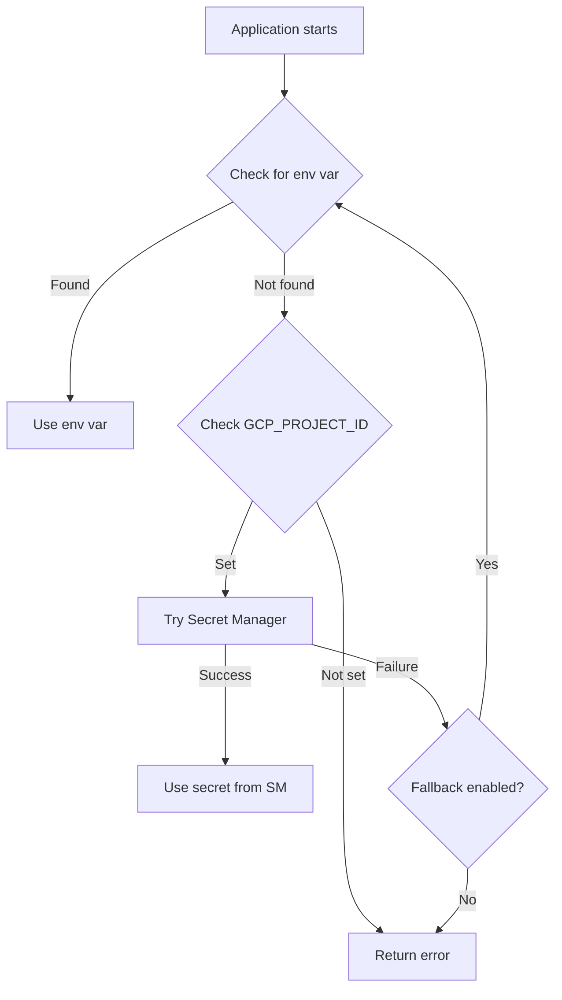

# Google Secret Manager Integration Guide

This document explains how to securely manage API keys and secrets for top200-rs using Google Secret Manager.

## Overview

The application supports two modes for secret management:

1. **Local Development**: Environment variables from `.env` file
2. **Production**: Google Secret Manager with automatic fallback to environment variables

The application automatically:
- Checks for environment variables first (for local development)
- Falls back to Google Secret Manager if env vars are not found (for production)
- Provides helpful error messages if neither source has the secret

## Quick Start

### For Local Development

1. Copy the example environment file:
   ```bash
   cp .env.example .env
   ```

2. Fill in your API keys:
   ```bash
   # Edit .env and add your keys
   FINANCIALMODELINGPREP_API_KEY=your_key_here
   POLYGON_API_KEY=your_key_here
   ```

3. Run the application:
   ```bash
   nix develop --command cargo run
   ```

### For Production (GCP)

1. Set up infrastructure with Terraform:
   ```bash
   cd terraform
   cp terraform.tfvars.example terraform.tfvars
   # Edit terraform.tfvars with your project ID

   terraform init
   terraform apply
   ```

2. Set secret values:
   ```bash
   ./scripts/setup-secrets.sh
   ```

3. Configure the application:
   ```bash
   export GCP_PROJECT_ID=your-project-id
   # Use Application Default Credentials
   gcloud auth application-default login

   # Or use a service account key
   export GOOGLE_APPLICATION_CREDENTIALS=/path/to/key.json
   ```

## Architecture

### Code Structure

```
src/
├── secrets.rs          # Secret Manager integration module
├── main.rs             # Updated to use secrets::get_secret_or_env()
├── marketcaps.rs       # Updated to use Secret Manager
├── specific_date_marketcaps.rs
├── historical_marketcaps.rs
└── ...
```

### Secret Loading Flow



### Authentication Methods

1. **Application Default Credentials (ADC)**:
   - Used when `GOOGLE_APPLICATION_CREDENTIALS` is NOT set
   - Works automatically in GCP environments (Cloud Run, GKE, etc.)
   - For local dev: `gcloud auth application-default login`

2. **Service Account Key File**:
   - Used when `GOOGLE_APPLICATION_CREDENTIALS` is set
   - Point to a JSON key file
   - Good for CI/CD pipelines and local development

## Terraform Infrastructure

### Resources Created

The Terraform configuration creates:

- **Service Account**: `top200-rs@PROJECT_ID.iam.gserviceaccount.com`
  - Role: `roles/secretmanager.secretAccessor`

- **Secrets** in Secret Manager:
  - `financialmodelingprep-api-key`
  - `polygon-api-key`
  - `anthropic-api-key`
  - `brevo-api-key`

- **Cloud Storage Bucket**: For data and exports
  - Versioning enabled
  - 90-day lifecycle policy

- **Artifact Registry**: For container images
  - Format: Docker
  - Location: Configured region (default: europe-west1)

### Required GCP APIs

Terraform automatically enables:
- Secret Manager API
- Cloud Run API
- Compute Engine API
- Cloud Build API
- Artifact Registry API
- IAM API

## Security Best Practices

### 1. Never Commit Secrets

Files in `.gitignore`:
- `.env` - Contains actual secrets
- `terraform.tfvars` - Contains project configuration
- `terraform/*.tfstate` - May contain secret values
- `*.json` - Service account keys

### 2. Use Least Privilege

The service account only has:
- `secretmanager.secretAccessor` - Read secrets
- `storage.objectAdmin` - Manage storage bucket
- `artifactregistry.reader` - Pull container images

### 3. Rotate Secrets Regularly

```bash
# Add new version to a secret
echo -n "NEW_API_KEY" | gcloud secrets versions add SECRET_NAME --data-file=-

# The application automatically uses the latest version

# Disable old version after testing
gcloud secrets versions disable VERSION_NUMBER --secret=SECRET_NAME

# Delete old version
gcloud secrets versions destroy VERSION_NUMBER --secret=SECRET_NAME
```

### 4. Audit Access

```bash
# View who accessed secrets
gcloud logging read "resource.type=secret_manager_secret" \
  --limit 50 \
  --format json

# Set up audit logging alerts
gcloud alpha logging sinks create secret-access-alerts \
  pubsub.googleapis.com/projects/PROJECT_ID/topics/secret-alerts \
  --log-filter='resource.type="secret_manager_secret"'
```

### 5. Use Workload Identity (GKE)

For GKE deployments:

```bash
# Create Kubernetes service account
kubectl create serviceaccount top200-rs

# Bind to GCP service account
gcloud iam service-accounts add-iam-policy-binding \
  top200-rs@PROJECT_ID.iam.gserviceaccount.com \
  --role roles/iam.workloadIdentityUser \
  --member "serviceAccount:PROJECT_ID.svc.id.goog[NAMESPACE/top200-rs]"

# Annotate K8s service account
kubectl annotate serviceaccount top200-rs \
  iam.gke.io/gcp-service-account=top200-rs@PROJECT_ID.iam.gserviceaccount.com
```

## Troubleshooting

### "Failed to fetch secret from Secret Manager"

**Cause**: Secret doesn't exist or no permission

**Solution**:
```bash
# Check if secret exists
gcloud secrets list --filter="name:SECRET_NAME"

# Check service account permissions
gcloud secrets get-iam-policy SECRET_NAME

# Grant access if needed
gcloud secrets add-iam-policy-binding SECRET_NAME \
  --member="serviceAccount:SA_EMAIL" \
  --role="roles/secretmanager.secretAccessor"
```

### "GOOGLE_APPLICATION_CREDENTIALS not found"

**Cause**: Neither ADC nor service account key is configured

**Solution**:
```bash
# Option 1: Use ADC (recommended for local dev)
gcloud auth application-default login

# Option 2: Use service account key
export GOOGLE_APPLICATION_CREDENTIALS=/path/to/key.json
```

### "Failed to create authenticator with ADC"

**Cause**: Invalid or missing ADC credentials

**Solution**:
```bash
# Revoke and re-authenticate
gcloud auth application-default revoke
gcloud auth application-default login

# Or check credential file
cat ~/.config/gcloud/application_default_credentials.json
```

### "Permission denied" when creating secrets

**Cause**: Insufficient permissions in GCP project

**Solution**:
```bash
# Check your roles
gcloud projects get-iam-policy PROJECT_ID \
  --flatten="bindings[].members" \
  --filter="bindings.members:user:YOUR_EMAIL"

# You need one of:
# - roles/owner
# - roles/editor
# - roles/secretmanager.admin
```

## Cost Optimization

### Secret Manager Pricing

- **Storage**: $0.06 per secret per month
- **Access**: $0.03 per 10,000 accesses
- **Replication**: Automatic replication included

### Reducing Costs

1. **Cache secrets in your application** (not implemented yet):
   ```rust
   // TODO: Add caching layer
   lazy_static! {
       static ref SECRET_CACHE: Mutex<HashMap<String, (String, Instant)>> =
           Mutex::new(HashMap::new());
   }
   ```

2. **Use environment variables for dev**:
   - Free for local development
   - No API calls to Secret Manager

3. **Delete unused secrets**:
   ```bash
   gcloud secrets delete OLD_SECRET_NAME
   ```

## Migration from .env to Secret Manager

### Step 1: Set up infrastructure

```bash
cd terraform
terraform apply
```

### Step 2: Migrate secrets

```bash
# Export from .env
source .env

# Import to Secret Manager
echo -n "$FINANCIALMODELINGPREP_API_KEY" | \
  gcloud secrets versions add financialmodelingprep-api-key --data-file=-

echo -n "$POLYGON_API_KEY" | \
  gcloud secrets versions add polygon-api-key --data-file=-
```

### Step 3: Test

```bash
# Set GCP project
export GCP_PROJECT_ID=your-project-id

# Remove .env to test Secret Manager
mv .env .env.backup

# Run application
gcloud auth application-default login
cargo run

# Verify it works
mv .env.backup .env
```

## Environment Variables Reference

### Required for Secret Manager

- `GCP_PROJECT_ID`: Your GCP project ID
- `GOOGLE_APPLICATION_CREDENTIALS`: Path to service account key (optional if using ADC)

### Local Development (Alternative)

- `FINANCIALMODELINGPREP_API_KEY`: Financial Modeling Prep API key
- `POLYGON_API_KEY`: Polygon.io API key
- `ANTHROPIC_API_KEY`: Anthropic API key (optional)
- `BREVO_API_KEY`: Brevo API key (optional)
- `DATABASE_URL`: SQLite database path (default: sqlite:data.db)

## API Reference

### `secrets::get_secret_or_env()`

Convenience function to get a secret from either environment or Secret Manager.

```rust
use crate::secrets;

let api_key = secrets::get_secret_or_env(
    "financialmodelingprep-api-key",  // Secret Manager name
    "FINANCIALMODELINGPREP_API_KEY",  // Environment variable name
)
.await?;
```

### `SecretManager::new()`

Create a new Secret Manager client.

```rust
use crate::secrets::{SecretManager, SecretManagerConfig};

let config = SecretManagerConfig {
    project_id: "my-project".to_string(),
    fallback_to_env: true,
};

let sm = SecretManager::new(config).await?;
let secret = sm.get_secret("my-secret").await?;
```

### `SecretManager::get_secrets()`

Get multiple secrets at once.

```rust
let secrets = sm.get_secrets(&[
    "financialmodelingprep-api-key",
    "polygon-api-key",
]).await?;

for (name, value) in secrets {
    println!("Secret {}: {}", name, value.chars().take(5).collect::<String>() + "...");
}
```

## Additional Resources

- [Google Secret Manager Documentation](https://cloud.google.com/secret-manager/docs)
- [Best Practices for Secrets](https://cloud.google.com/secret-manager/docs/best-practices)
- [Rust google-secretmanager1 crate](https://docs.rs/google-secretmanager1)
- [Application Default Credentials](https://cloud.google.com/docs/authentication/application-default-credentials)
- [Workload Identity](https://cloud.google.com/kubernetes-engine/docs/how-to/workload-identity)
